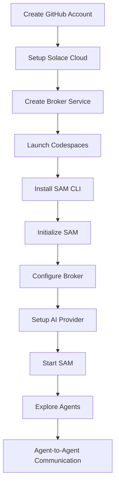

# Solace Agent Mesh Workshop

Welcome to the **Solace Agent Mesh (SAM)** workshop! This repository contains comprehensive guides and resources to help you set up and explore SAM — Solace's innovative agent-based event-driven architecture platform.

---
##### 
##### <center>STAR the Solace Agent Mesh GitHub Repository! </center>
##### <center>Take a moment to visit:</center>
##### <center>https://github.com/SolaceLabs/solace-agent-mesh/</center>
##### <center>And, hit that STAR button :)</center>
##### 
--- 
## 🎯 Workshop Overview

This workshop teaches you how to:
- Set up a Solace Cloud broker service
- Configure GitHub Codespaces for development
- Install and initialize Solace Agent Mesh
- Deploy and interact with AI-powered agents
- Explore agent-to-agent (A2A) communication

## 📁 Repository Structure

```
├── README.md                           # This file
├── solace-cloud-signup-workshop.md     # Step-by-step Solace Cloud setup
├── solace-agent-mesh-workshop.md       # Complete SAM installation guide
├── broker/                             # Screenshots for broker setup
│   ├── login-page.png
│   ├── signup-page.png
│   ├── create-service.png
│   └── ...
└── sam/                               # Screenshots for SAM setup
    ├── github-workshop-repo.png
    ├── sam-init.png
    ├── sam-chat.png
    └── ...
```

## 🚀 Quick Start

### Prerequisites
- GitHub account
- Modern web browser
- Internet connection

### Step-by-Step Setup

#### 1. Solace Cloud Setup
Follow the guide: [`solace-cloud-signup-workshop.md`](./solace-cloud-signup-workshop.md)
- Create your Solace Cloud account
- Set up a PubSub+ broker service
- Configure connection details

#### 2. SAM Installation & Configuration
Follow the guide: [`solace-agent-mesh-workshop.md`](./solace-agent-mesh-workshop.md)
- Launch GitHub Codespaces
- Install Solace Agent Mesh CLI
- Initialize SAM with your broker
- Configure AI provider settings
- Start your SAM instance

## 🛠️ What You'll Learn

### Core Concepts
- **Event-driven architecture** with Solace PubSub+
- **Agent-based systems** and their capabilities
- **AI integration** with messaging platforms
- **Cloud-native development** with Codespaces

### Hands-on Experience
- Setting up enterprise messaging infrastructure
- Deploying and managing AI agents
- Real-time agent communication
- Troubleshooting distributed systems

## 🌟 Key Features Covered

- **Multi-protocol Support**: WebSockets, MQTT, REST, AMQP
- **AI Integration**: OpenAI-compatible LLM providers
- **Visual Interface**: Interactive chat and network visualization
- **Agent Orchestration**: Automated agent-to-agent workflows
- **Cloud Deployment**: GitHub Codespaces integration

## 📚 Workshop Materials

### Documentation
- [`solace-cloud-signup-workshop.md`](./solace-cloud-signup-workshop.md) - Complete broker setup
- [`solace-agent-mesh-workshop.md`](./solace-agent-mesh-workshop.md) - SAM installation guide

### Visual Resources
- **broker/** - Step-by-step screenshots for Solace Cloud setup
- **sam/** - Visual guide for GitHub Codespaces and SAM configuration

## 🔧 Technical Requirements

### System Requirements
- **Browser**: Chrome, Firefox, Safari, or Edge (latest versions)
- **GitHub Account**: Required for Codespaces access
- **Machine Type**: 4-core Codespace instance recommended

### Services Used
- **Solace Cloud**: PubSub+ broker service (Developer tier)
- **GitHub Codespaces**: Cloud development environment
- **OpenAI Compatible LLM**: AI provider for agent capabilities

## 🎓 Learning Outcomes

By completing this workshop, you will:
1. **Understand** event-driven architecture principles
2. **Deploy** enterprise messaging infrastructure
3. **Configure** AI-powered agent systems
4. **Implement** agent-to-agent communication patterns
5. **Troubleshoot** distributed messaging applications

## 🤝 Getting Help

### During the Workshop
- Ask instructors for assistance
- Use the chat interface in SAM for agent capabilities
- Refer to visual guides in the screenshots folders

### Additional Resources
- [Solace Developer Portal](https://solace.dev)
- [SAM Documentation](https://docs.solace.com/Solace-Agent-Mesh/)
- [GitHub Codespaces Docs](https://docs.github.com/en/codespaces)

## 📝 Workshop Flow



## 🏆 Next Steps

After completing the workshop:
1. **Explore Additional Agents**: Deploy more specialized agents
2. **Custom Integrations**: Connect your own applications
3. **Production Setup**: Learn enterprise deployment patterns
4. **Community Engagement**: Join Solace developer forums

## 📄 License

This workshop content is provided for educational purposes during Solace Agent Mesh workshops.

---

**© 2025 Solace Developer Workshops**  
*Happy Learning! 🚀*