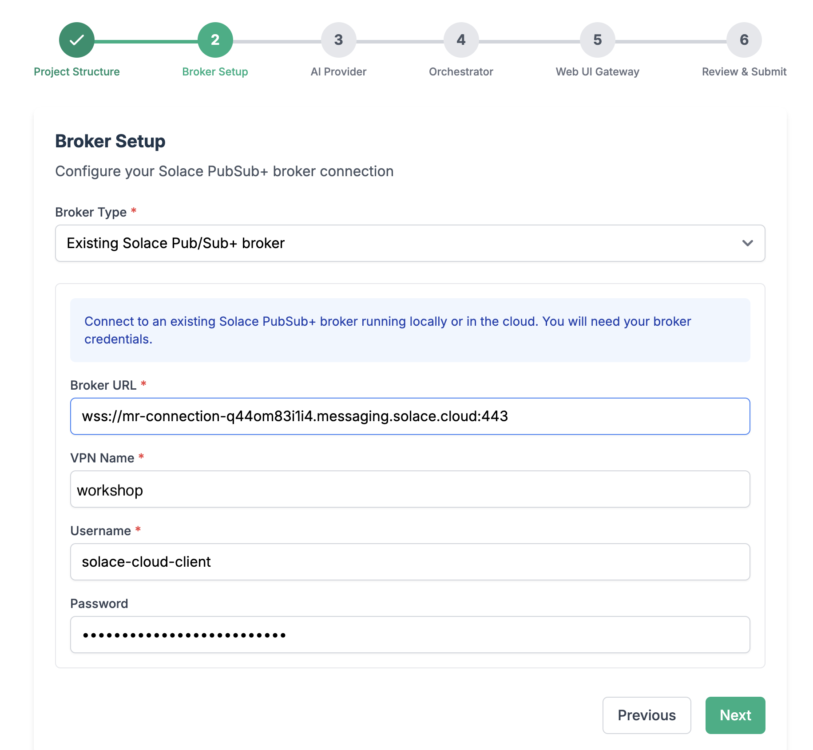
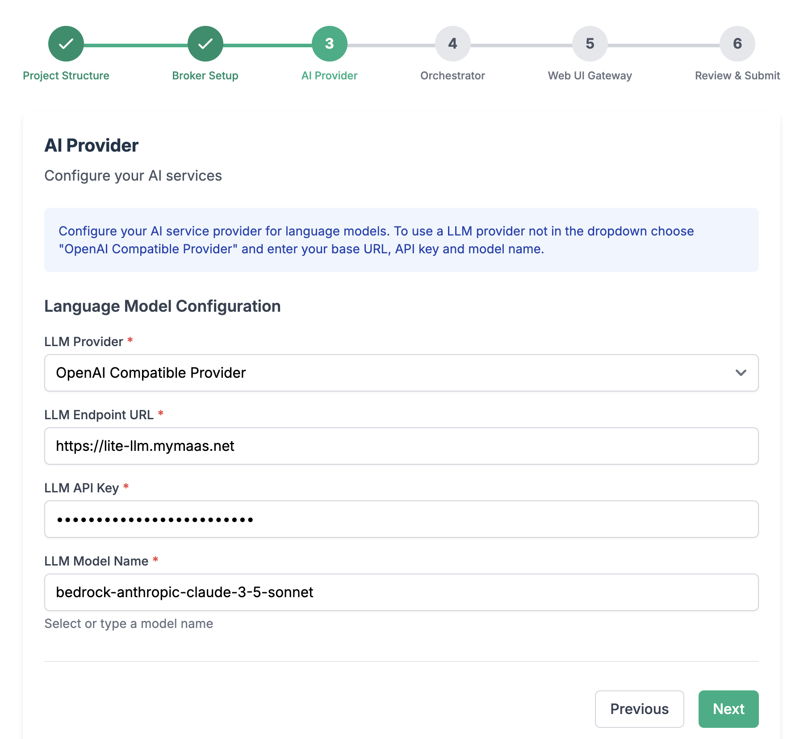
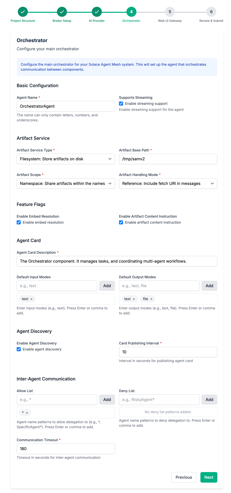
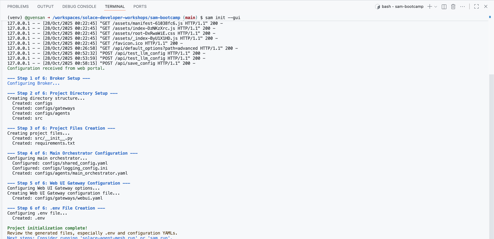
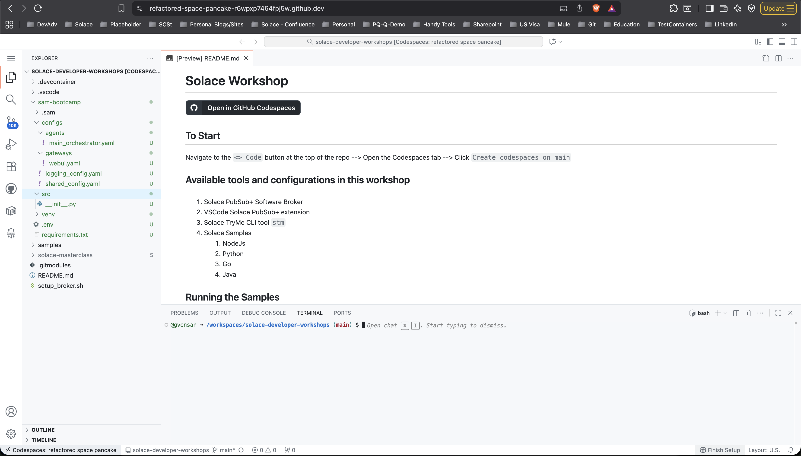

# 🌐 Welcome to the Solace Agent Mesh Workshop

> **Before You Begin:**  
> You’ll need a GitHub account to participate in this workshop.  
> Don’t have one yet? Follow these quick steps:  
> - Visit [GitHub](https://github.com/)  
> - Click **Sign up** or **Continue with Google**  
> - Follow the prompts to complete setup

This guide walks you through setting up **GitHub Codespaces** and installing **Solace Agent Mesh (SAM)** for the workshop.

---

## 🧩 1. Setup GitHub Codespace

### Step 1: **Open the Workshop Repository**  
   Visit [Solace Developer Workshops](https://github.com/SolaceDev/solace-developer-workshops/)  
   

### Step 2: Click **Open in GitHub Codespaces**  
   

### Step 3: Choose **Change Options** → set machine type to **4-core**  
   

### Step 4: Click **Create Codespace**  
   Once it’s ready, you’ll see Visual Studio Code running in your browser — your personal VM workspace.  
   

---

## ⚙️ 2. Install Solace Agent Mesh (SAM)

### Step 1: Install SAM CLI
In the terminal, run the following commands.
```
mkdir sam-bootcamp
cd sam-bootcamp
```

### Step 2: Setup Python virtual environment
```
python3.12 -m venv venv
```

### Step 3: Activate virtual environment
```
source venv/bin/activate
```

### Step 4: Install solace agent mesh
```
pip install solace-agent-mesh
```

### Step 5: Verify sam instalation
```
sam -v
```
You should see the installed sam version information.

---

## 🚀 3. Initialize Solace Agent Mesh

### Step 1: Initialize SAM
In the `/workspaces/solace-developer-workshops/sam-bootcamp` directory, run the following


```
sam init --gui
```

This opens a browser portal — click **Open in Browser** (or use Cmd/Ctrl + Click on the link in the log, e.g., `http://127.0.0.1:8000`).  


In the opened web page, configure SAM.


1. From here, choose "Advanced Setup" to spin up an instance of the Agent Mesh that uses the Solace Broker as the communication backbone.

> Note that the simple setup "Getting Started Quickly" spins up Agent Mesh without the Solace Broker and uses in-memory queues instead. This is not meant for production ready development and proof of concept project that require high performance and multiple Agentic workflow interactions.

2. Choose a namespace for your project


> The namespace will act as the topic root for all events in SAM

3. Configure connection to the Solace Broker

- Log in to your **Solace Cloud Console**  
- Navigate to **Cluster Manager → Connect**  
  
- Keep **Broker Type** as *Existing Solace Pub/Sub+ Broker*  
- Copy connection details into the **Broker Setup** screen  
  

4. Configure your LLM endpoint, API Key, and Model name
> The model of choice impact the performance of your results and system behaviour. A performative model is recommended for advanced use-cases

- Choose **OpenAI Compatible Provider**
- Set **LLM Endpoint URL** to `https://lite-llm.mymaas.net`
- Enter the **LLM API Key** shared during the workshop
- Select **bedrock-anthropic-claude-3-5-sonnet** from the model dropdown  
  

5. Configure the orchestrator agent


> Keep all the configuration parameters as default. You can explore the other options for configuring the orchestrator agent to see what you have available for fine tuning the behaviour

6. Configure the WebUI Gateway

> Note: Choose any Session Secret Key needed for the WebUI. Keep the remaining configurations as default.

>If you are running a local broker on a docker container with SAM Enterprise in a docker container as well, we will configure this in the following steps

7. After initialization completes, you’ll see confirmation in your Codespaces terminal:  


The sam-bootcamp folder will have the basic structure created, and you are all set to go.
 
 

---

## ▶️ 4. Start Solace Agent Mesh

1. Check installation:
   ```bash
   sam -version
   ```

2. Start SAM:
   ```bash
   sam run
   ```

You’ll see logs as the system starts:  


> ⚠️ **Note:** When prompted to open a port (8080), wait until logs stabilize, then open the browser view or use the URL `http://127.0.0.1:8000`.

Your Solace Agent Mesh Chat interface will now appear:  
  


---

## 🤖 5. Explore Agents

Now, let’s interact with SAM.

Enter in the chat area:
```
What agents do you have access to and what are their capabilities?
```


You can visualize agent interactions (e.g., **Orchestrator ↔ LLM**) by clicking the **network** icon below any chat response.

> 💬 As you install more agents, you can always ask SAM for a list of available agents and capabilities.

---

## ▶️ 6. Install Agents

While Solace Agent Mesh is running in the current terminal, open a **new terminal** and launch the plugin catalog to add new agents.


Solace provides a set of reusable, open-source agents. SAM makes it easy to install agents from these repositories with just a few clicks.

- **SolaceLabs Core Plugins:**  
  https://github.com/SolaceLabs/solace-agent-mesh-core-plugins  
- **SolaceCommunity Plugins:**  
  https://github.com/solacecommunity/solace-agent-mesh-plugins  

> **Note:** The SolaceCommunity repository is open source and contains community-contributed agents — we encourage contributions!

### Steps

1. In the terminal, navigate to your SAM workspace and activate the environment:
   ```bash
   cd sam-bootcamp
   source venv/bin/activate
   ```

2. Launch the plugin catalog:
   ```bash
   sam plugin catalog
   ```

   This opens the catalog portal in your browser (typically `http://127.0.0.1:5003/?config_mode=pluginCatalog`).  
   

3. Review available agents and their capabilities by clicking **More** on each tile.

4. Add the following registries:  
   - **SolaceLabs Repository:**  
     - URL: `https://github.com/SolaceLabs/solace-agent-mesh-core-plugins`  
     - Name: `SolaceLabs`
   - **SolaceCommunity Repository:**  
     - URL: `https://github.com/solacecommunity/solace-agent-mesh-plugins`  
     - Name: `SolaceCommunity`

5. Click **Refresh** to load all available agents.

6. Install these example agents:  
   - `sam_geo_information`  
   - `sam_mermaid`  
   - `find_my_ip`  

> Give each agent a meaningful name (e.g., use hyphens instead of underscores).

When done, you can close the SAM catalog tab and stop the process with `Ctrl+C`.

---

## ▶️ 7. Running Agents

You have two options:

a) **Restart SAM:**  
   Stop the process with `Ctrl+C` and run again:  
   ```bash
   sam run
   ```

b) **Run agents individually:**  
   ```bash
   sam run <agent_yaml_file>
   ```

This allows agents to run independently — even on different machines — much like microservices.

For this lab, stop the current process and restart SAM in the first terminal.

---

## ▶️ 8. Review the Registered Agents

In the SAM Chat console, click the **Agents** tool on the left sidebar. You should now see the newly registered agents alongside the **Orchestrator** agent.  


Click **Click for details** on any agent card to learn more about its configuration and skills.

Now, let’s interact again with SAM:

```
What agents do you have access to and what are their capabilities?
```


You can visualize agent interactions (e.g., **Orchestrator ↔ LLM**) by clicking the **network** icon below any chat response.

---

## ▶️ 9. Try Sample Queries

Try these sample prompts in your SAM chat:

```
What is the weather around me today?
```

```
Create a bar chart showing the population of the five largest cities in Australia.
```

Or something fun:

```
Create a simple flowchart showing the steps to make a cup of tea.
```

The more diverse the agents, the richer your conversational analytics experience — all powered by **Solace Event Mesh**.

Yes, we’ll discuss the role of Event Mesh in Solace Agent Mesh during the session.

---

### ✅ That’s It!
You’ve successfully:  
- Set up GitHub Codespaces  
- Installed and initialized Solace Agent Mesh  
- Started your own SAM instance  
- Explored and installed agents  

> 🧠 Next step: Try deploying additional agents and experiment with **Agent-to-Agent (A2A)** communication.

---

### 📚 Additional Resources

- [Solace Agent Mesh GitHub Repository](https://github.com/SolaceLabs/solace-agent-mesh)  
- [Official Solace Agent Mesh Documentation](https://docs.solace.dev/agent-mesh/)  
- [Solace Developer Portal](https://solace.dev)  

---

**For questions or troubleshooting:**  
Ask during the workshop or visit [Solace Agent Mesh Documentation](https://solacelabs.github.io/solace-agent-mesh/docs/documentation/getting-started/introduction/) or ask in [Solace Community](https://community.solace.com/c/solace-agent-mesh/16).

---

*© 2025 Solace Developer Workshops — For educational use only.*
